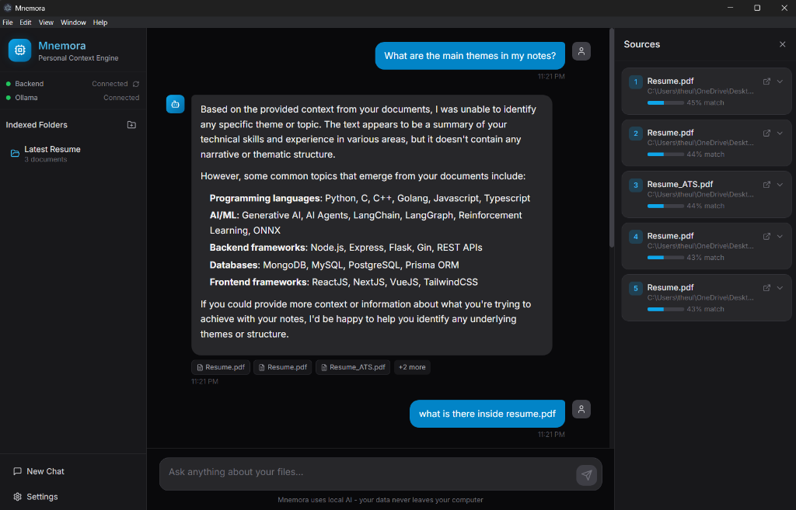
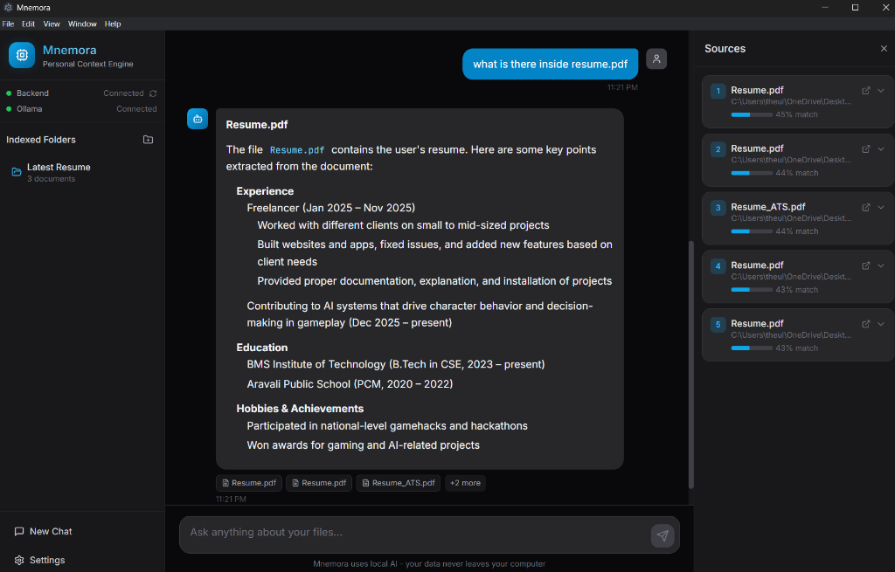
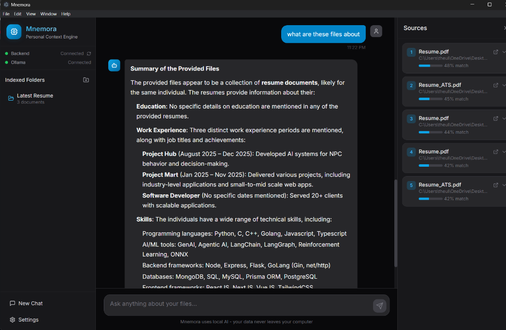

<div align="center">

# 🧠 Mnemora

### Local-First Personal Context Engine

**Chat with your files using AI — completely offline, 100% private.**

[](https://www.gnu.org/licenses/gpl-3.0)
[](https://www.electronjs.org/)
[](https://python.org)
[](https://reactjs.org)
[](https://ollama.ai)

[Features](#-features) • [Screenshots](#-screenshots) • [Installation](#-installation) • [Usage](#-usage) • [Architecture](#-architecture) • [Contributing](#-contributing) • [License](#-license)

</div>

---

## 🎯 What is Mnemora?

Mnemora is a **desktop application** that lets you have natural conversations with your local documents — PDFs, Markdown notes, code files, and more. Powered entirely by **local AI models** through Ollama, your data never leaves your computer.

### Why Mnemora?

| Feature | Description |
|---------|-------------|
| 🔒 **100% Private** | All processing happens locally. No cloud, no data sharing, no subscriptions |
| ⚡ **Semantic Search** | Find information across thousands of documents using natural language |
| 📚 **Source Citations** | Every answer shows exactly which files it came from with relevance scores |
| 🎨 **Beautiful UI** | Modern, dark-themed interface built with React and Tailwind CSS |
| 🧩 **Extensible** | Open source, well-documented, and easy to customize |

---

## ✨ Features

### Core Capabilities

- **📁 Index Any Folder** — Add folders containing your documents and let Mnemora understand them
- **💬 Natural Chat Interface** — Ask questions in plain English and get intelligent answers
- **🔗 Smart Citations** — See exactly which documents contributed to each answer
- **📊 Relevance Scoring** — Visual indicators show how relevant each source is
- **⚡ Streaming Responses** — See AI responses as they're generated in real-time

### Document Support

| Type | Extensions | Features |
|------|------------|----------|
| **Markdown** | `.md`, `.markdown` | Obsidian [[wiki-links]], #tags, YAML frontmatter |
| **PDF** | `.pdf` | Full text extraction with page markers |
| **Plain Text** | `.txt` | Direct content indexing |
| **Code** | `.py`, `.js`, `.ts`, `.go`, `.rs`, etc. | Language detection, structure extraction |

### Powered By

- **[Ollama](https://ollama.ai)** — Local LLM inference with models like Llama 3.2, Mistral, CodeLlama
- **[ChromaDB](https://trychroma.com)** — High-performance vector database for semantic search
- **[FastAPI](https://fastapi.tiangolo.com)** — Modern Python backend with async support
- **[Electron](https://electronjs.org)** — Cross-platform desktop application
- **[React](https://reactjs.org)** — Component-based UI with Zustand for state management

---

## 📸 Screenshots

<div align="center">

### Chat Interface
Ask natural language questions about your documents.



### Document Understanding
Get detailed answers with information extracted from your files.



### Source Citations
See exactly which files contributed to each answer with relevance scores.



</div>

---

## 🚀 Installation

### Prerequisites

| Requirement | Version | Download |
|-------------|---------|----------|
| Node.js | 18+ | [nodejs.org](https://nodejs.org/) |
| Python | 3.10+ | [python.org](https://python.org/) |
| Ollama | Latest | [ollama.ai](https://ollama.ai/download) |

### Quick Start

```bash
# 1. Clone the repository
git clone https://github.com/AIkaptan/Mnemora.git
cd Mnemora

# 2. Install Node.js dependencies
npm install

# 3. Install Python dependencies
cd backend
pip install -r requirements.txt
cd ..
```

### First Run

Mnemora includes **automatic setup** — on first launch, it will:

1. ✅ Check if Ollama is installed and running
2. ✅ Guide you to install Ollama if needed  
3. ✅ Download required AI models automatically
4. ✅ Start the application once ready

---

## 📖 Usage

### Running the Application

You need **3 terminals** running:

```bash
# Terminal 1: Start Ollama
ollama serve

# Terminal 2: Start Python backend
cd backend
python main.py

# Terminal 3: Start the Electron app
npm run electron
```

### Adding Documents

1. Click the **➕** button next to "Indexed Folders"
2. Select a folder containing your documents
3. Wait for indexing to complete (progress bar shown)
4. Start chatting with your files!

### Asking Questions

Simply type natural language questions in the chat:

- *"What are the main themes in my notes?"*
- *"Summarize the key points from my resume"*
- *"What projects have I worked on?"*
- *"Find all mentions of machine learning"*

---

## 🏗️ Architecture

```
┌─────────────────────────────────────────────────────────────┐
│                     ELECTRON (Desktop)                       │
│  ┌────────────────────────────────────────────────────────┐ │
│  │            React + Tailwind CSS + Zustand              │ │
│  │   Sidebar | Chat | Sources Panel | Settings Modal      │ │
│  └────────────────────────────────────────────────────────┘ │
│                            ↕ HTTP                            │
└─────────────────────────────────────────────────────────────┘
                             ↕
┌─────────────────────────────────────────────────────────────┐
│                  PYTHON BACKEND (FastAPI)                    │
│  ┌──────────┐  ┌──────────┐  ┌──────────┐  ┌─────────────┐ │
│  │ Indexer  │  │   RAG    │  │ Parsers  │  │ Vector Store│ │
│  │          │  │ Pipeline │  │ MD/PDF/  │  │  (ChromaDB) │ │
│  │          │  │          │  │  Code    │  │             │ │
│  └──────────┘  └──────────┘  └──────────┘  └─────────────┘ │
│                            ↕ HTTP                            │
└─────────────────────────────────────────────────────────────┘
                             ↕
┌─────────────────────────────────────────────────────────────┐
│                        OLLAMA                                │
│         Local LLM Inference + Embedding Generation           │
│              (llama3.2, nomic-embed-text, etc.)              │
└─────────────────────────────────────────────────────────────┘
```

### Project Structure

```
mnemora/
├── electron/               # Electron main process
│   ├── main.js             # Window management, IPC handlers
│   └── preload.js          # Secure bridge to renderer
├── src/                    # React frontend
│   ├── components/         # UI components
│   │   ├── Chat/           # ChatView, MessageBubble
│   │   ├── Sidebar/        # Folder management, status
│   │   ├── Sources/        # Citations panel
│   │   ├── Settings/       # Model selection, theme
│   │   └── Setup/          # First-run setup wizard
│   ├── stores/             # Zustand state management
│   └── index.css           # Tailwind + custom styles
├── backend/                # Python FastAPI backend
│   ├── api/                # REST endpoints
│   ├── services/           # Core business logic
│   │   ├── indexer.py      # Document processing
│   │   ├── rag.py          # RAG pipeline
│   │   ├── vector_store.py # ChromaDB wrapper
│   │   └── ollama_client.py# Ollama API client
│   └── parsers/            # Document parsers
│       ├── markdown_parser.py
│       ├── pdf_parser.py
│       └── code_parser.py
├── docs/                   # Documentation & screenshots
├── SETUP.md                # Detailed setup guide
├── CONTRIBUTING.md         # Contribution guidelines
├── CODE_OF_CONDUCT.md      # Community standards
└── SECURITY.md             # Security policy
```

---

## 🤝 Contributing

We welcome contributions! Please see our [Contributing Guidelines](CONTRIBUTING.md) for details.

### Ways to Contribute

- 🐛 **Report Bugs** — Open an issue with reproduction steps
- 💡 **Suggest Features** — Share your ideas for improvements
- 📝 **Improve Docs** — Help make our documentation better
- 🔧 **Submit PRs** — Fix bugs or add new features

### Development Setup

1. Fork the repository
2. Create a feature branch: `git checkout -b feature/amazing-feature`
3. Make your changes and test thoroughly
4. Commit with descriptive messages: `git commit -m 'feat: add amazing feature'`
5. Push to your fork: `git push origin feature/amazing-feature`
6. Open a Pull Request

---

## 📜 License

This project is licensed under the **GNU General Public License v3.0** — see the [LICENSE](LICENSE) file for details.

This means you are free to:
- ✅ Use the software for any purpose
- ✅ Study and modify the source code
- ✅ Distribute copies
- ✅ Distribute modified versions

Under the condition that derivative works are also licensed under GPL-3.0.

---

## 🙏 Acknowledgments

- [Ollama](https://ollama.ai/) — For making local LLM inference accessible
- [ChromaDB](https://www.trychroma.com/) — For the excellent vector database
- [Electron](https://www.electronjs.org/) — For cross-platform desktop apps
- [Tailwind CSS](https://tailwindcss.com/) — For beautiful utility-first styling
- The open-source AI community for continuous inspiration

---

<div align="center">

**Made with ❤️ for privacy-conscious knowledge workers**

[⬆ Back to Top](#-mnemora)

</div>
